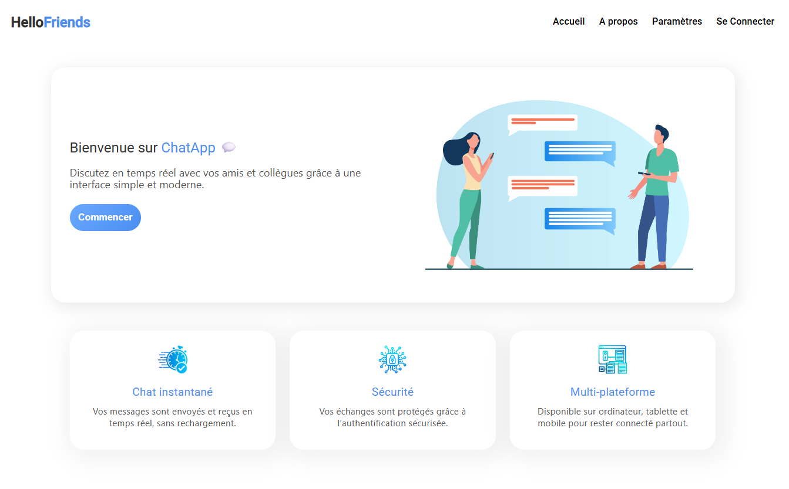

HelloFriends – Application de messagerie en temps réel
=================================================



🚀 Présentation
---------------

**ChatApp** est une application web de messagerie instantanée moderne, développée avec **Angular 17** pour le frontend et **.NET 8** pour le backend. Elle permet aux utilisateurs de :

*   Envoyer des **messages publics** dans un salon commun.
    
*   Envoyer des **messages privés** entre utilisateurs.
    
*   Gérer l’authentification sécurisée avec **JWT**.
    
*   Afficher l’état de connexion des utilisateurs en temps réel.
    
*   Profiter d’une interface responsive et ergonomique.
    

Le projet a été **déployé sur Azure DevOps** avec mise en place de **pipelines CI/CD**, garantissant des déploiements fiables et rapides.

🛠️ Technologies utilisées
--------------------------

### Backend

*   **.NET 8** avec **ASP.NET Core Web API**
    
*   **SignalR** pour la communication temps réel
    
*   **JWT** pour l’authentification sécurisée
    
*   **Entity Framework Core** avec **SQL Server** ou **PostgreSQL**
    
*   **Domain Driven Design (DDD)** et **Clean Architecture**
    

### Frontend

*   **Angular 17 (standalone components)**
    
*   **SignalR client** pour les communications temps réel
    
*   **Reactive Forms & Services** pour la gestion de l’état et des formulaires
    
*   **SCSS / Tailwind CSS** pour un design moderne et responsive
    

### DevOps & Déploiement

*   **Azure DevOps** pour CI/CD
    
*   **Pipelines de Build et Release** automatisés
    
*   **Web App Azure** pour le déploiement du backend
    

🎯 Fonctionnalités principales
------------------------------

1.  **Messagerie publique**
    
    *   Tout utilisateur connecté peut envoyer et recevoir des messages en temps réel.
        
2.  **Messages privés**
    
    *   Chaque utilisateur peut discuter en privé avec un autre utilisateur.
        
    *   Historique des conversations locales et affichage en temps réel.
        
3.  **Authentification & sécurité**
    
    *   Gestion des comptes utilisateurs avec **JWT**.
        
    *   Protection des endpoints backend et des messages privés.
        
    *   Expiration automatique des tokens.
        
4.  **Interface utilisateur**
    
    *   Sidebar dynamique avec liste des utilisateurs connectés.
        
    *   Indication du statut de connexion.
        
    *   Design responsive et moderne, compatible mobile et desktop.
        
5.  **Déploiement et pipelines CI/CD**
    
    *   Pipeline **CI** : Build, tests unitaires, linting, vérification qualité du code.
        
    *   Pipeline **CD** : Déploiement automatique sur Azure Web App après build réussi.
        


💻 Installation et lancement
----------------------------

### Backend

```
cd backend
dotnet restore
dotnet build
dotnet run
```

### Frontend

```
cd frontend
npm install
ng serve
```

Accéder à l’application : [http://localhost:4200](http://localhost:4200)

🔐 Authentification
-------------------

*   Les utilisateurs doivent se **connecter** pour accéder aux salons de chat.
    
*   Le **JWT** est généré lors du login et stocké dans le navigateur.
    
*   L’état de connexion est géré en temps réel via un **BehaviorSubject** dans le AuthService.
    

🌐 SignalR & temps réel
-----------------------

*   Le **hub SignalR** gère :
    
    *   La diffusion des messages publics.
        
    *   L’envoi et la réception de messages privés.
        
    *   La liste des utilisateurs connectés.
        
*   Le frontend Angular utilise un **service singleton** ChatService pour :
    
    *   Se connecter au hub.
        
    *   Écouter les messages entrants.
        
    *   Envoyer des messages en temps réel.
        

🎨 Design
---------

*   Interface moderne avec **sidebar fixe** et messages séparés par utilisateur.
    
*   Messages privés affichés avec style différencié pour l’expéditeur et le destinataire.
    
*   Avatar par défaut si l’utilisateur n’a pas de photo.
    
*   Footer élégant, discret et fixe en bas de page.
    

📈 Valeur ajoutée
-----------------

*   Expérience **complète Fullstack** : frontend Angular + backend .NET.
    
*   Gestion **réactive** de l’authentification et des communications.
    
*   **Déploiement en production** avec CI/CD sur Azure DevOps.
    
*   Application extensible pour :
    
    *   Notifications push
        
    *   Gestion de fichiers et images
        
    *   Chat de groupe
        

👨‍💻 Compétences démontrées
----------------------------

*   **Angular 17** : standalone components, services réactifs, templates dynamiques.
    
*   **.NET 8 & SignalR** : hubs, gestion des connections, architecture modulaire.
    
*   **JWT & sécurité** : authentification, rôle utilisateur, expiration tokens.
    
*   **CI/CD** : pipelines de build et release sur Azure DevOps.
    
*   **Design UX/UI** : responsive, sidebar, footer, avatars et couleurs harmonisées.
    

🔗 Déploiement
--------------

*   **Backend** : Azure Web App (.NET 8)
    
*   **Frontend** : hébergé sur le même domaine ou séparé (CORS configuré pour SignalR)
    
*   **Pipeline CI** : build + tests unitaires + lint
    
*   **Pipeline CD** : déploiement automatique après validation CI
    

📝 Remarques
------------

*   Le projet peut être facilement étendu pour :
    
    *   Ajout de notifications en temps réel
        
    *   Historique des conversations côté serveur
        
    *   Gestion multi-salons et groupes
        
    *   Authentification OAuth2 / social login
        

📂 Contact / Auteur
-------------------

*   **Auteur** : Ndongo Medoune NDIAYE
    
*   **Email** : ndongomedoune.ndiaye@gmail.com
    
*   **LinkedIn** : https://linkedin.com/in/nmndiaye
